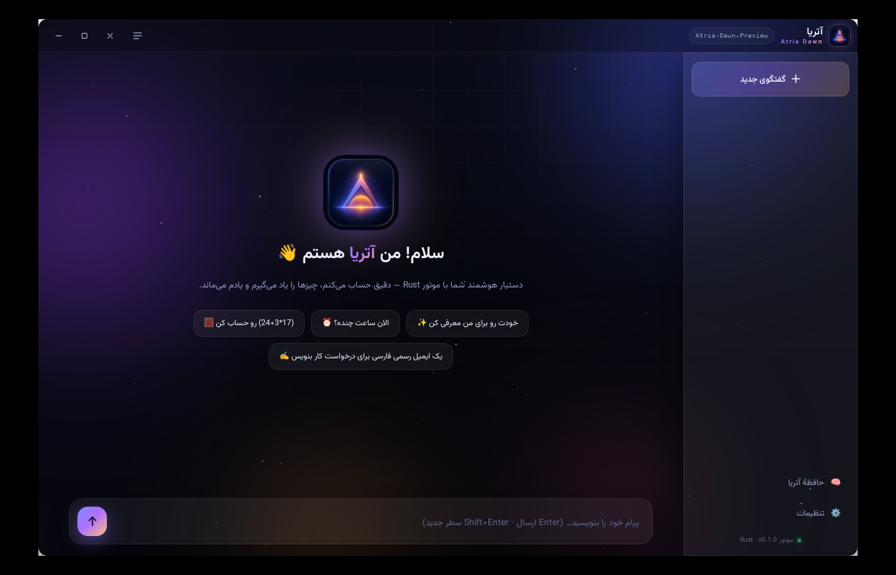

# آتریا — دستیار هوشمند دسکتاپ 🌅

<p align="center"></p>

**Atria Dawn** یک اپ دسکتاپ ویندوز برای چت و کار با هوش مصنوعی **آتریا** (مدل `Atria-Dawn-Preview`) است —
ساخته‌شده با **موتور Rust** و پوستهٔ **Tauri v2**، با طراحی انیمیشنی «طلوع» (Dawn).



## ✨ امکانات

- 🤖 **ایجنت واقعی** — حلقهٔ agent با ابزارهای داخلی (مثل ایجنت‌های حرفه‌ای):
  - 🧮 **ماشین‌حساب** — محاسبات دقیق ریاضی
  - ⏰ **ساعت و تاریخ** — زمان UTC و تهران
  - 🧠 **حافظه** — `remember` / `recall` برای یادآوری چیزها بین گفتگوها
  - 📂 **دسترسی به فایل‌ها** — `list_files` / `read_file` فقط در ورک‌اسپیس و با مسدودسازی مسیرهای حساس؛ حالت پرسش، diff و تأیید صریح دارد؛ نوشتن خودکار محدوده‌دار و با backup/Undo است
  - 🔎 **جست‌وجو و خواندن وب برای همهٔ ارائه‌دهنده‌ها** — مستقل از قابلیت جست‌وجوی داخلی هر مدل، با محدودیت میزبان عمومی و بدون اجرای اسکریپت
  - ⬇ **دانلود فایل‌های وب (Full Access)** — فقط تصویر/مستند عمومی، فقط داخل پوشهٔ دسکتاپ (یا پوشهٔ تنظیم‌شده)، بدون جایگزینی فایل موجود، بدون نشست مرورگر و بدون شِل؛ مثلاً دانلود دسته‌ای تصاویر یک تگ پینترست با `pinterest_tag_images`
  - 🐙 **GitHub خواندن/نوشتن** — جست‌وجوی repo، خواندن فایل/issue/PR؛ issue/comment/PR و ایجاد/به‌روزرسانی فایل پس از پیش‌نمایش و تأیید جداگانهٔ هر اقدام (به‌جز Full Access صریح)
  - 🖥 **سیاست کنترل رایانه** — «پرسش پیش از اقدام» یا خودکارِ محدود (باز کردن URL عمومی و نوشتن داخل ورک‌اسپیس). این نسخه کنترل سراسری ماوس/صفحه‌کلید، شِل یا دسترسی مدیر ندارد؛ Full Access فقط پس از opt-in صریح، ابزارهای مجاز موجود را بدون تأیید موردی اجرا می‌کند.
- 🌊 **پاسخ زنده (Streaming)** — تایپ پاسخ لحظه‌به‌لحظه با SSE
- 🧩 **کد خط‌به‌خط** — رندر افزایشی بلوک‌های کد؛ هر خط با انیمیشن اضافه می‌شود، بدون ریفرش صفحه
- 🌐 **چند سرویس‌دهنده (Multi-Provider)** — آتریا (Messages / Chat Completions)، OpenAI، **Google Gemini**، Groq، DeepSeek، OpenRouter و حالت سفارشی
- 🔑 **کلید API فقط از سوی شما** — هیچ کلیدی در برنامه تعبیه نشده است
- 💭 **نمایش تفکر** — بلوک‌های reasoning مدل (Atria-Dawn یک مدل Reasoning است)
- 🛠 **نمایش ابزارها** — کارت‌های انیمیشنی برای هر فراخوانی ابزار
- 💬 **گفتگوهای نامحدود** — ذخیرهٔ خودکار، جابه‌جایی سریع
- 📁 **حالت پروژه** — یادداشت، فهرست کارها، checkpointهای خودکار و ادامه در چت تازه
- 🧠 **مدیریت context** — تخمین مصرف، بودجهٔ قابل تنظیم و خلاصه‌سازی extractive تاریخچهٔ قدیمی؛ متن کامل در برنامه می‌ماند
- 🩺 **آزمون اتصال** — درخواست کوتاه برای سنجش سلامت مدل و latency (ممکن است هزینهٔ ناچیز داشته باشد)
- ⭐ **مدل‌های محبوب و قابلیت‌ها** — علاقه‌مندی‌ها و برچسب‌های استنتاجی برای تصویر/ابزار/استدلال
- 🔐 **کلیدهای امن ویندوز** — ذخیره در Windows Credential Manager برای حساب کاربر؛ localStorage فقط مشخصات اتصال را نگه می‌دارد
- 🔄 **به‌روزرسانی امضاشده** — امضای Ed25519 مانیفست و SHA-256 پیش از نصب بررسی می‌شود؛ تأیید کاربر لازم است
- 🎨 **طراحی Dawn** — پس‌زمینهٔ شفقی متحرک، شیشه‌ای (glassmorphism)، انیمیشن‌های روان
- 📝 **مارک‌داون** — کد، لیست، نقل‌قول + دکمهٔ کپی
- 🖥 **پنجرهٔ بدون قاب** — مینیمایز/بیشینه/بستن سفارشی، گوشه‌های گرد
- 🇮🇷 **رابط کاملاً فارسی/راست‌چین** با فونت وزیرمی‌دان

## 📥 دانلود و نصب

از بخش [**Releases**](../../releases) آخرین نسخه را بگیرید:

| فایل | توضیح |
|------|--------|
| `atria.exe` | نسخهٔ قابل‌اجرا (پرتابل) — کافی است اجرا کنید |
| `Atria-Dawn-win64.zip` | همان نسخه با نام `Atria.exe` + README + LICENSE |

> نیازمندی: ویندوز ۱۰/۱۱ با **WebView2 Runtime** (روی ویندوز ۱۱ از پیش نصب است؛ [دانلود از مایکروسافت](https://developer.microsoft.com/microsoft-edge/webview2/) در صورت نیاز).

## ⚙️ تنظیم اتصال و کلید API

۱. اپ را اجرا کنید و به **تنظیمات ← کلیدها و API ← ＋ اتصال جدید** بروید.
۲. در «قالب آماده» سرویس‌دهنده را انتخاب کنید تا گویش API و Base URL پر شود؛ یا «سفارشی» را انتخاب و آدرس را خودتان وارد کنید. سپس کلید همان سرویس را بنویسید.
۳. مدل‌ها را با **دریافت از سرور** جست‌وجو و انتخاب کنید، یا نام مدل را دستی اضافه کنید. فقط مدل‌های اضافه‌شده در منوی چت نشان داده می‌شوند؛ اتصال تازه به‌طور خودکار فعال می‌شود.
۴. برای **DeepSeek وب**، نوع API را روی گزینهٔ DeepSeek وب بگذارید و userToken حساب را وارد کنید؛ این روش به کلید API نیاز ندارد و غیررسمی است.

> 🔑 هیچ کلیدی داخل برنامه تعبیه نشده؛ کلید خودتان را وارد کنید (کلید آتریا با پیشوند `atr_`). در ویندوز کلیدها در Windows Credential Manager و برای حساب فعلی ذخیره می‌شوند؛ در `localStorage` فقط metadata اتصال باقی می‌ماند. در نصب تازه اتصال یا مدل پیش‌فرضی ساخته نمی‌شود.

## 🔎 وب، GitHub و سیاست خودکارسازی

- در **تنظیمات ← شخصیت و ابزارها**، ابزار وب و GitHub را جداگانه روشن/خاموش کنید. جست‌وجوی وب از موتور عمومی DuckDuckGo استفاده می‌کند و خروجی وب/GitHub باید دادهٔ غیرقابل‌اعتماد تلقی شود.
- خواندن مخزن‌های عمومی GitHub به توکن نیاز ندارد. برای مخزن خصوصی یا نوشتن، در همان تنظیمات یک **Fine-grained personal access token تازه** وارد و «ذخیره و آزمون» را بزنید؛ مقدار توکن فقط داخل برنامه به native command می‌رسد و در Windows Credential Manager ذخیره می‌شود، نه در گفتگو، درخواست مدل یا `localStorage`.
- دسترسی کمینه: فقط مخزن‌های لازم را انتخاب کنید؛ `Metadata: Read-only`، و در صورت نیاز نوشتن `Contents`, `Issues`, و `Pull requests` را روی `Read and write` بگذارید. پشتیبانی‌شده‌ها: issue/comment/PR و ایجاد یا به‌روزرسانی فایل؛ حذف/merge پشتیبانی نمی‌شود. به‌روزرسانی فایل فقط اگر SHA از زمان پیش‌نمایش تغییر نکرده باشد اجرا می‌شود. محتوای مخزن خصوصی که می‌خوانید به مدل فعال ارسال می‌شود؛ توکن ارسال نمی‌شود.
- هر تغییر GitHub یک کارت پیش‌نمایش دارد و فقط با کلیک جداگانهٔ **«تأیید و ارسال به GitHub»** اجرا می‌شود؛ حالت خودکارِ محدود این الزام را تغییر نمی‌دهد. **Full Access** (opt-in صریح و جداگانه) می‌تواند عملیات allowlist‌شدهٔ GitHub را بدون تأیید موردی اجرا کند.
- حالت **پرسش پیش از اقدام** پیش‌فرض است. حالت **خودکارِ محدود** فقط URL عمومی را در مرورگر پیش‌فرض باز می‌کند و فایل نسبی داخل ورک‌اسپیس را با پشتیبان تغییر می‌دهد. دسترسی شبکهٔ محلی، شِل، حذف، دسترسی مدیر و کنترل کلیک/ماوس/صفحه‌کلید در این نسخه فعال نیست.

## 🛠 ساخت از سورس

```bash
# نیازمندی: Rust (rustup.rs) + WebView2 Runtime
git clone https://github.com/Manixpcshot/atria-ai.git
cd atria-desktop

# اجرای نسخهٔ دیباگ
cargo run -p atria-app

# ساخت نسخهٔ ریلیز (خروجی: target/release/atria.exe)
cargo build --release -p atria-app

# تست‌های موتور
cargo test -p atria-core
```

ساخت خودکار ویندوز با **GitHub Actions** انجام می‌شود: پس از انتشار Release، ورک‌فلو [`.github/workflows/windows-release.yml`](.github/workflows/windows-release.yml) برنامه را می‌سازد، harness رابط و تست‌های Rust (موتور و مخزن امن) را اجرا و EXE/ZIP را با checksum و مانیفست امضاشدهٔ Ed25519 منتشر می‌کند. کلید خصوصی امضا فقط در GitHub Actions Secret با نام `ATRIA_UPDATE_PRIVATE_KEY` نگه‌داری می‌شود؛ کلید عمومی در برنامه تعبیه شده است. یادداشت‌های نصب و تغییرات هر نسخه در `docs/releases/` نگهداری می‌شوند.

## 🧱 معماری

```
atria-desktop/
├── crates/
│   ├── atria-core/      # 🦀 موتور Rust: کلاینت Messages API، SSE، حلقهٔ ایجنت، ابزارها
│   │   ├── src/client.rs    # کلاینت سازگار با Anthropic Messages API
│   │   ├── src/openai.rs    # کلاینت Chat Completions (OpenAI / Gemini / Groq / …)
│   │   ├── src/sse.rs       # دیکدر جریان SSE
│   │   ├── src/agent.rs     # حلقهٔ ایجنت (مدل ⇄ ابزار)
│   │   ├── src/tools.rs     # ابزارها + پیش‌نمایش/backup فایل‌ها
│   │   ├── src/web.rs       # جست‌وجو/خواندن وب و بازکردن URL با محدودیت ایمنی
│   │   ├── src/github.rs    # خواندن GitHub و mutationهای مرحله‌بندی‌شده
│   │   └── src/memory.rs    # حافظهٔ پایدار remember/recall
│   └── atria-app/       # 🖥 پوستهٔ Tauri v2 + پنجرهٔ سفارشی
├── frontend/            # 🎨 UI انیمیشنی (HTML/CSS/JS + وزیرمی‌دان)
└── .github/workflows/   # ساخت خودکار ویندوز → ضمیمه به Release
```

### API

سازگار با **Anthropic Messages API** (پیش‌فرض، کامل‌ترین حالت ایجنت) و **OpenAI Chat Completions** (گویش `openai` برای Gemini و دیگران):

```bash
curl -X POST https://api.atria-asi.ai/v1/messages \
  -H "x-api-key: $ATRIA_API_KEY" \
  -H "anthropic-version: 2023-06-01" \
  -H "Content-Type: application/json" \
  -d '{"model": "Atria-Dawn-Preview", "max_tokens": 1024,
       "messages": [{"role": "user", "content": "hi"}]}'
```

موتور از **Streaming (SSE)** و **Tool Use** (فراخوانی ابزار) پشتیبانی می‌کند.

## 📄 لایسنس

[MIT](LICENSE)
